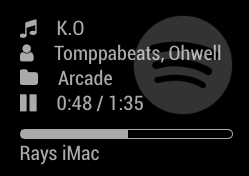
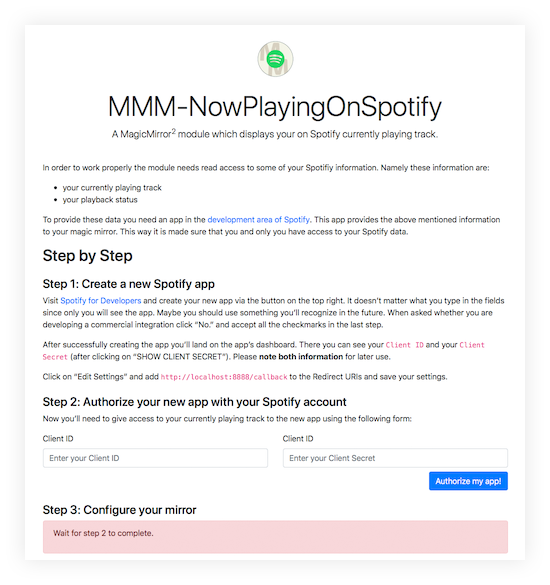

# MMM-NowPlayingOnSpotify
A module for the [MagicMirror](https://github.com/MichMich/MagicMirror) project by [Michael Teeuw](https://github.com/MichMich) displaying the song currently playing on Spotify.


[](https://codeclimate.com/github/raywo/MMM-NowPlayingOnSpotify/maintainability) 
[](https://codeclimate.com/github/raywo/MMM-NowPlayingOnSpotify/test_coverage)
[](https://snyk.io/test/github/raywo/mmm-NowPlayingOnSpotify?targetFile=package.json)
[](https://greenkeeper.io/)
[](https://david-dm.org/raywo/MMM-NowPlayingOnSpotify)
[](https://gitter.im/raywo)


## How it works
After installing the module and configuring and setting up the Spotify app the module displays the song you are currently listening to on Spotify. It shows on which of your devices you’re playing the song. If you like you can also display the album cover.

To be able to display your currently playing song the module must connect to the Spotify service and query your private data. For obvious reasons this is not possible for arbitrary apps – or for that matter MagicMirror modules. There are third party solutions which will enable access to your Spotify data. This module is designed to be independent from third party services. Everything you need is in this module respectively is created by yourself.

## Screenshots
|  |  |  |
|---|---|---|
| Nothing is playing. | A song is playing and `showCoverArt` is set to `false`. | A song is playing and `showCoverArt` is set to `true`. |

## Preconditions

* MagicMirror<sup>2</sup> instance
* Node.js version >= 7
* npm
* a Spotify account


## Installing
Installing the module is quite straight forward. Getting it to display your playing songs requires a bit more work.

### Step 1 – Install the module

In your MagicMirror directory: 

```bash
cd modules
git clone https://github.com/raywo/MMM-NowPlayingOnSpotify.git
cd MMM-NowPlayingOnSpotify
npm install
```

### Step 2 – Create and authorise a Spotify app
In order to be able to connect to the Spotify API you need to create an app in the [Spotify developer area](https://beta.developer.spotify.com/dashboard/applications). Then you need to authorise the app to access your personal data. Et voilà!

The module provides you with a special app which describes all the necessary steps and which guides you through the whole process. To use this app change into the `authorization` folder and start the app by typing `node app`. 

```bash
cd authorization
node app
```

When the app is running you can access it by opening `localhost:8888` in your browser. Provided you are doing this directly on your Raspberry Pi. If you want to access the app remotely just type the ip address or the name of your Raspberry like so for instance: `http://raspi:8888`. Then you should see the authorisation app like below.

||
|---|

Now just follow the steps described there. After successful authorisation the app will display a code snippet under the heading **Step 3: Configure your mirror**. Copy that snippet and paste it into your mirror’s `config.js`. Configure the rest to your needs and you’re good to go.


## Updating

Go to the module’s folder inside MagicMirror modules folder and pull the latest version from GitHub and install:

```bash
git pull
npm install
```


## Configuring
There is not very much to configure but here are the options:

| Option | Description |
|--------|-------------|
| `showCoverArt` | <p>A boolean value decribing whether an album cover photo should be displayed or not.</p><p>**Type:** `boolean` **OPTIONAL**<br>**Example:** `false`<br>**Default Value:** `true`</p> |
| `updatesEvery` | <p>An integer determining the interval for display updates.</p><p>**Type:** `integer` **OPTIONAL**<br>**Example:** `5`<br>**Default Value:** `1`</p><p>**Note:** With the default setting the display is updated every second. So when you skip to the next song it is virtually immediately visible. Also the progress bar runs smoothly. If you increase the value you may relieve the strain on your Raspberry’s processor but your display will not be as up-to-date. </p> |
| `clientID` | <p>A string describing the `clientID` of your Spotify app.</p><p>**Type:** `string` **REQUIRED**<br>**Example:** `"acecg8a4..."`<br>**Default Value:** none</p><p>**Note:** The easiest way to get that value is by copying the code snippet from step 3 in the [authorisation app](#step-2-–-create-and-authorise-a-spotify-app).</p> |
| `clientSecret` | <p>A string describing the `clientSecret` of your Spotify app.</p><p>**Type:** `string` **REQUIRED**<br>**Example:** `"87978346..."`<br>**Default Value:** none</p><p>**Note:** The easiest way to get that value is by copying the code snippet from step 3 in the [authorisation app](#step-2-–-create-and-authorise-a-spotify-app).</p> |
| `accessToken` | <p>A string describing the `accessToken ` of your Spotify app.</p><p>**Type:** `string` **REQUIRED**<br>**Example:** `"WaIO1987..."`<br>**Default Value:** none</p><p>**Note:** The easiest way to get that value is by copying the code snippet from step 3 in the [authorisation app](#step-2-–-create-and-authorise-a-spotify-app).</p> |
| `refreshToken` | <p>A string describing the `refreshToken ` of your Spotify app.</p><p>**Type:** `string` **REQUIRED**<br>**Example:** `"HIuLH798..."`<br>**Default Value:** none</p><p>**Note:** The easiest way to get that value is by copying the code snippet from step 3 in the [authorisation app](#step-2-–-create-and-authorise-a-spotify-app).</p> |

Here is an example for an entry in `config.js`

```javascript
{
    module: "MMM-NowPlayingOnSpotify",
    position: "top_right",

    config: {
        showCoverArt: false,
        clientID: "<YOUR_CLIENT_ID>",
        clientSecret: "<YOUR_CLIENT_SECRET>",
        accessToken: "<YOUR_ACCESS_TOKEN>",
        refreshToken: "<YOUR_REFRESH_TOKEN>"
    }
}
```


## Special Thanks

* [Michael Teeuw](https://github.com/MichMich) for inspiring me and many others to build a MagicMirror module.
* The community of magicmirror.builders for help in the development process and all contributors for finding and fixing errors in this module.


## Contributing

If you find any problems, bugs or have questions, please [open a GitHub issue](https://github.com/raywo/MMM-NowPlayingOnSpotify/issues) in this repository.
